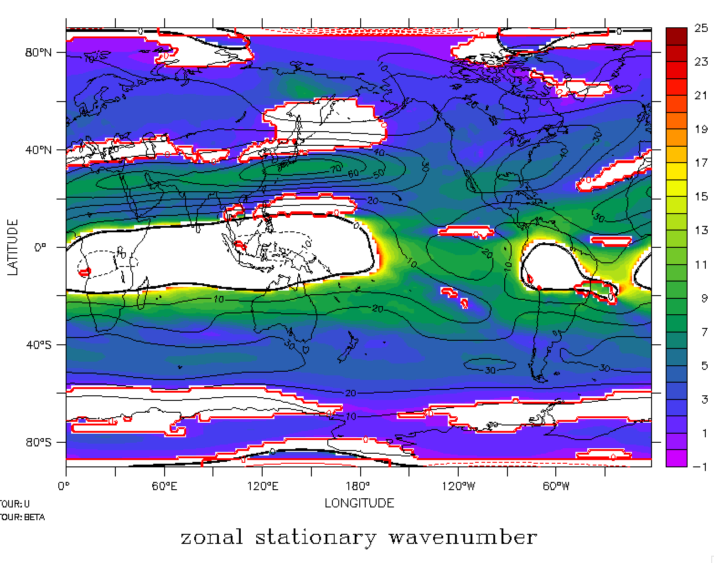

# Stationary_Wavenumber (Ks) and Rossby Wave Source (RWS)

Hoskins and Ambrizzi (1993) underscores the critical influence of the background zonal flow on the behavior of Rossby waves. They found that the zonal stationary wavenumber Ks can be interpreted as a refractive index for Rossby waves and that regions with maxima in Ks act as waveguides.

In spherical coordinates, Ks is given by

$K_s=a\cos \phi\left (\frac{\beta_M}{\bar{U}} \right )$

where $\bar{U}$ is a time mean of the upper-tropospheric zonal wind, $\phi$ is the latitude, $a$ is the equatorial Earth radius, $\Omega$ being Earth’s rotation rate and

$\beta_M =\frac{2 \Omega\cos \phi}{a}-\frac{1}{a^2}\frac{\partial}{\partial \phi }\left [ \frac{1}{\cos \phi} \frac{\partial}{\partial \phi } \left ( \bar{U}\cos \phi \right )\right ]$

The zonal wavenumber Ks is the number of zonal waves that would fit around the corresponding local latitude circle. In linear dynamics, Rossby waves of stationary wavenumber k are anticipated to be reflected at or decay beyond the turning latitude in which Ks = k. Furthermore, Rossby waves are refracted toward values where Ks > k,  so that regions where Ks is maximized, such as the westerly jets, act as waveguides (Hoskins and Ambrizzi 1993). 

**Ks_January_mean** :
Ks(color shading), black contour line (U200), and red contour line ($\beta_M < 0$)

  

# Rossby Wave Source (RWS)

The Rossby wave source is a term used to describe the mechanisms that generate and maintain Rossby waves. The RWS was derived from the barotropic vorticity equation in pressure coordinates as in Sardeshmukh and Hoskins (1988). When expressing the horizontal winds in terms of their divergent and rotational components, the Rossby wave activity can be calculated as follows:

RWS= $-\nabla \cdot \left({v}_{x}\zeta \right)$ = $-\left(\zeta \nabla \cdot {v}_{x}+{v}_{x}\cdot \nabla \zeta \right)$
